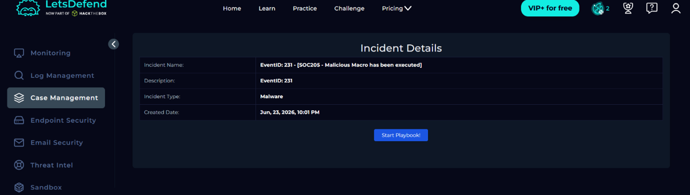
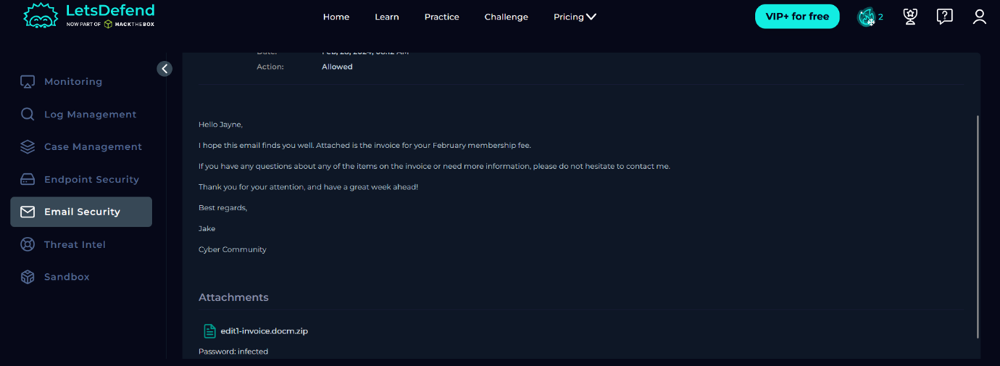
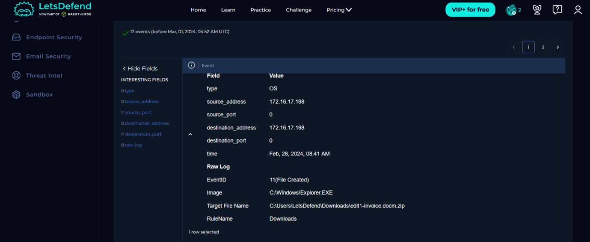
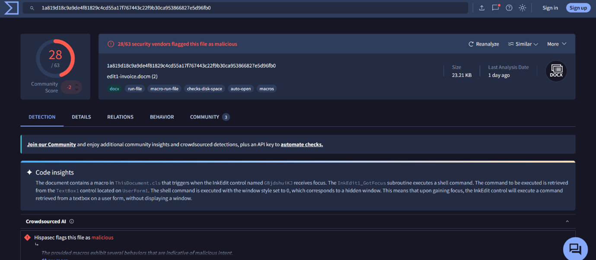
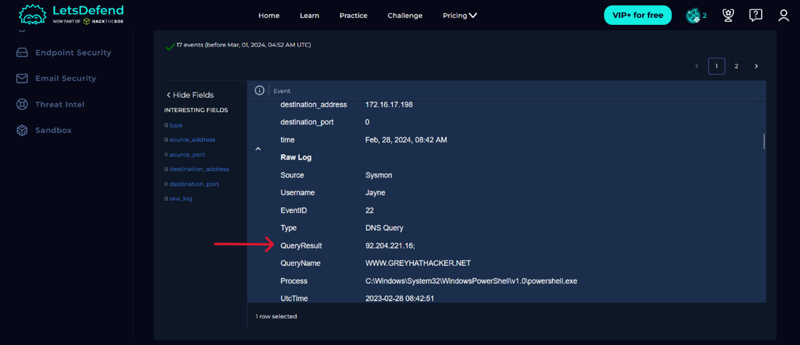
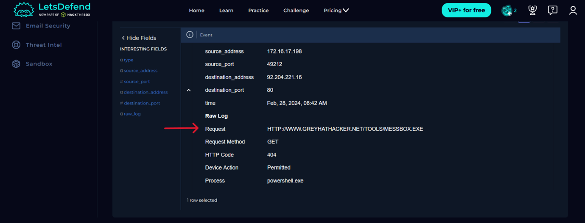
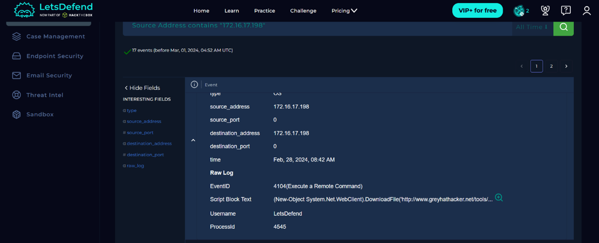
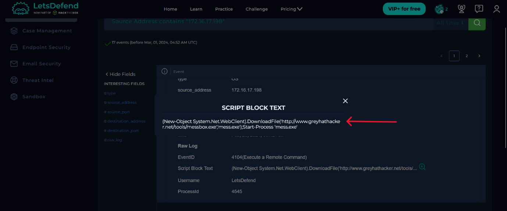
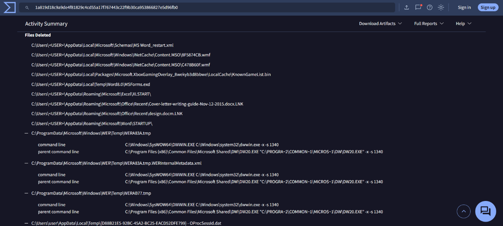
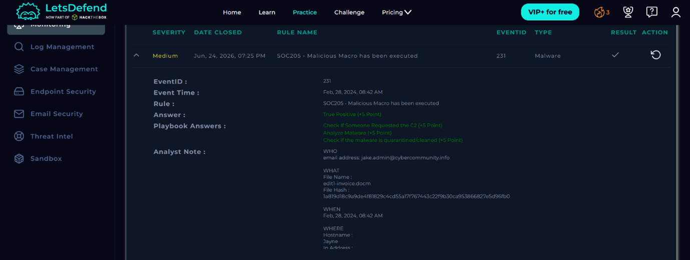

# SOC Incident Report: SOC205 - Malicious Macro Executed (Alert #231)

**Severity:** Medium | **Status:** Closed | **Verdict:** True Positive

---

## 1. Alert Summary

| Field | Value |
| :--- | :--- |
| **Alert ID** | 231 |
| **Alert Name** | SOC205 - Malicious Macro has been executed |
| **Triggered (UTC)** | Feb 28, 2024, 08:42 AM |
| **Analyst** | Analyst |
| **Severity** | Medium |
| **Final Verdict** | True Positive |
| **Status** | Closed |

---

## 2. Executive Summary

An email containing an archive named `edit1-invoice[.]docm.zip` was delivered to user Jayne. Upon investigation, it was confirmed that the user extracted and executed the Trojan horse document `edit1-invoice[.]docm`. The malicious macro invoked PowerShell to execute DNS queries and establish contact with command-and-control (C2) infrastructure. 

Although an initial GET request for payload retrieval returned an HTTP 404 error, the malware successfully downloaded, renamed, and executed a secondary malicious payload (`mess[.]exe`) via a PowerShell WebClient object. Post-exploitation analysis revealed that the malware erased device event and process logs to obscure its presence on the system.

---

## 3. Alert Details

| Attribute | Value |
| :--- | :--- |
| **Detection Rule** | SOC205 - Malicious Macro has been executed |
| **Recipient** | user@letsdefend.io |
| **Recipient IP Address** | 172.16.17.198 |
| **Sender** | attacker@cybercommunity.info |
| **Subject** | February Membership Fee |
| **File Name** | `Edit1-invoice[.]docm` |
| **File Hash (SHA-256)** | `1a819...96fb0` |

---

## 4. Investigation & Triage

### 4.1 Initial Endpoint Inspection
Investigation began on host **Jayne** (172.16.17.198). Endpoint logs revealed no process or event records, indicating anti-forensic evidence destruction by the threat.

  
*_Figure 2: Endpoint telemetry showing missing process and event records post-infection._*

### 4.2 Email Security Analysis
Email logs confirmed delivery of a spear-phishing email on **Feb 28, 2024, at 08:12 UTC** with the attached archive `edit1-invoice[.]docm.zip`.

  
*_Figure 3: Phishing email delivered to user Jayne containing edit1-invoice[.]docm.zip._*

### 4.3 Execution & Malware Analysis
Filtering log management records by host IP `172.16.17.198` confirmed archive extraction and file opening. OSINT lookup on VirusTotal scored the SHA-256 hash `1a81...6fb0` as malicious (**28/63 security vendors**).

  
*_Figure 4: Event log showing the user extracting and opening edit1-invoice.docm._*

  
*_Figure 5: VirusTotal threat intelligence report for edit1-invoice[.]docm._*

### 4.4 C2 Communication & Secondary Payload Delivery
Execution of the macro triggered PowerShell, generating Sysmon Event ID 22 (DNS Query) for `WWW.GREYHATHACKER[.]NET` (resolved IP: `92.204.221[.]16`).

  
*_Figure 6: Sysmon Event ID 22 recording DNS query for C2 infrastructure via PowerShell._*

An initial HTTP GET request to retrieve `messbox[.]exe` returned an HTTP 404 error.

  
*_Figure 7: HTTP GET request to C2 infrastructure returning HTTP status 404.

The malware subsequently executed a PowerShell WebClient script block (Event ID 4104) to download `messbox[.]exe` from `92.204.221[.]16`, save it locally as `mess[.]exe`, and launch the process. VirusTotal confirmed `mess[.]exe` as a malicious payload.

  
*_Figure 8: Event log capturing remote command execution via PowerShell.

  
*_Figure 9: PowerShell Script Block logging (Event ID 4104) showing file download and execution commands.

  
*_Figure 10: VirusTotal behavior report detailing automated file and event log deletion capabilities.


*_Figure 11: Completed SOC investigation on the alert.

---

## 5. Threat Intelligence & Indicators of Compromise (IOCs)

| Indicator | Type | Source | Assessment | Context |
| :--- | :--- | :--- | :--- | :--- |
| `1a819...96fb0` | SHA-256 Hash | VirusTotal | Malicious | Trojan attachment hash |
| `92.204.221.16` | IPv4 Address | DNS/Log Analysis | Malicious | C2 Destination Server |
| `WWW.GREYHATHACKER[.]NET` | Domain | DNS/Log Analysis | Malicious | Embedded C2 Domain |
| `messbox[.]exe` | File Name | Endpoint Telemetry | Malicious | Initial payload download attempt |
| `mess[.]exe` | File Name | Endpoint Telemetry | Malicious | Renamed executed secondary payload |

---

## 6. Timeline

| Time (UTC) | Event |
| :--- | :--- |
| **08:12** | Phishing email delivered to user Jayne |
| **08:42** | Malicious macro executed; alert raised |
| **11:41** | Analyst assigned; investigation and triage initiated |
| **13:55** | Incident closed as True Positive; IOCs blocked; email purged; host isolated |

---

## 7. STIX 2.1 Object

```json
{
  "type": "bundle",
  "id": "indicator--f5626182-1fad-45c8-84ae-2a3a9bc04ceb",
  "objects": [
    {
      "type": "indicator",
      "spec_version": "2.1",
      "id": "indicator--3b8479f5-fc41-49ef-9963-dc3e410bd9db",
      "created": "2026-06-24T10:27:00.000Z",
      "modified": "2026-06-24T10:27:00.000Z",
      "name": "Trojan file hash",
      "indicator_types": ["malicious-activity"],
      "hashes": {
        "SHA-256": "1a819d18c9a9de4f81829c4cd55a17f767443c22f9b30ca953866827e5d96fb0"
      },
      "pattern_type": "stix",
      "valid_from": "2026-06-12T08:41:13.000Z"
    },
    {
      "type": "indicator",
      "spec_version": "2.1",
      "id": "indicator--c1a9d7e3-5b2f-4a8c-bd14-6e3f8a2c5d77",
      "created": "2026-06-24T10:27:00.000Z",
      "modified": "2026-06-24T10:27:00.000Z",
      "name": "Malicious url",
      "indicator_types": ["malicious-activity"],
      "pattern": "[url:value = 'hxxp://WWW.GREYHATHACKER.NET']",
      "pattern_type": "stix",
      "valid_from": "2026-06-24T10:27:00.000Z"
    }
  ]
}
```

---

## 8. MITRE ATT&CK Mapping

| Tactic | Technique | ID | Evidence |
| :--- | :--- | :--- | :--- |
| **Initial Access** | Phishing: Spearphishing Attachment | `T1566.001` | Malicious `.docm.zip` email attachment |
| **Execution** | Command & Scripting Interpreter: PowerShell | `T1059.001` | Macro spawned PowerShell to invoke WebClient download |
| **Execution** | User Execution: Malicious File | `T1204.002` | User opened extracted `.docm` file |
| **Defense Evasion** | Indicator Removal: Clear Command History / Logs | `T1070` | Malware cleared endpoint process and event logs post-execution |

---

## 9. Impact & Containment Actions

1. **Host Isolation:** Immediately isolated endpoint `172.16.17.198` from the network to halt lateral movement.
2. **Threat Eradication:** Purged the spear-phishing email containing `edit1-invoice[.]docm.zip` from user Jayne's inbox.
3. **Blocklist Enforcement:** Submitted domain `WWW.GREYHATHACKER[.]NET` and destination IP `92.204.221.16` to perimeter security controls.
4. **Credential Security:** Initiated an immediate password reset for user Jayne.
5. **Security Awareness:** Recommended mandatory refresher phishing training focusing on email attachment verification.
